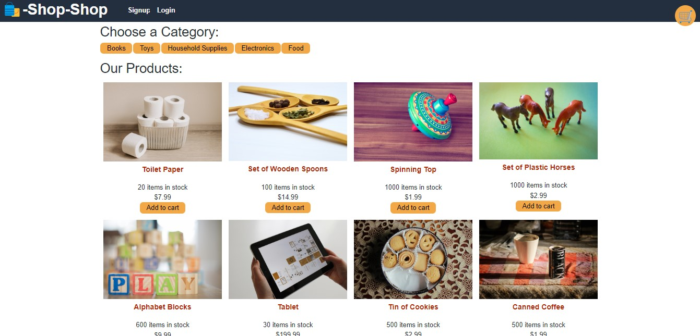

# Shop Shop

### Description
This full stack M.E.R.N. application is a forum where the user can securely and dynamically login to their account to shop. Checkout functionality is provided by Stripe.

### License

This application is licensed under MIT

### Application Demo

### Table of Contents
- [Description](#description)
- [Contributing](#contributing)
- [Tests](#tests)
- [Questions?](#questions)

### Contributing
No contributions at this time.

### Tests
  UPDATE_PRODUCTS,
  UPDATE_CATEGORIES,
  UPDATE_CURRENT_CATEGORY,
  ADD_TO_CART,
  ADD_MULTIPLE_TO_CART,
  REMOVE_FROM_CART,
  UPDATE_CART_QUANTITY,
  CLEAR_CART,
  TOGGLE_CART

### Questions
GitHub Username: (kcaseychamberlain) 

View the project in GitHub at: https://github.com/KCaseyChamberlain/shop-shop

View the application live hosted at:  https://evening-crag-27119.herokuapp.com/
    
If you have any questions, contact Casey at: caseygchamberlain@gmail.com
